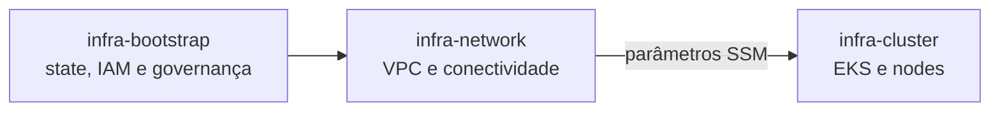

# infra-bootstrap

Produto de infraestrutura responsável pela fundação compartilhada da conta AWS.
Provisiona recursos globais e pré-requisitos consumidos pelos demais produtos da
plataforma, sem assumir ownership de VPC, cluster, workloads ou observabilidade.

## Escopo

Inclui:

- bucket S3 compartilhado para states Terraform, com versionamento, criptografia
  e bloqueio de acesso público;
- provider OIDC do GitHub Actions;
- role e policy de CI do próprio `infra-bootstrap`, restritas ao environment
  protegido `production`;
- role e policy de CI do `infra-network`, limitadas ao backend, recursos de rede
  e ao prefixo SSM publicado pelo produto;
- role de CloudWatch Logs e configuração global da conta do API Gateway.

Não inclui VPC, sub-redes, gateways, rotas, endpoints, DNS de infraestrutura,
Amazon EKS ou serviços compartilhados do Kubernetes.

## Dependências e consumidores



O `infra-network` consome o bucket informado por `terraform_state_bucket`. A
role publicada em `infra_network_github_actions_role_arn` será usada na migração
do pipeline de access keys estáticas para OIDC.

## Bootstrap inicial e migração do state

O bootstrap não pode usar, na primeira execução, o backend que ele próprio ainda
vai criar. A implantação inicial usa state local:

```bash
cp terraform.tfvars.example terraform.tfvars
terraform init
terraform fmt -check -recursive
terraform validate
terraform plan -out=tfplan
terraform apply tfplan
```

O repositório usa configuração parcial do backend S3 em `backend.tf`. Depois que
o bucket existir, migre o state local antes de gerar novos planos:

```bash
cp terraform.tfstate terraform.tfstate.pre-migration.backup
terraform init -migrate-state \
  -backend-config="bucket=orange-ks8-logs" \
  -backend-config="key=bootstrap/dev/terraform.tfstate" \
  -backend-config="region=us-east-1" \
  -backend-config="use_lockfile=true"
terraform state list
```

Não remova o backup local até confirmar que todos os recursos aparecem no state
remoto. O lockfile do backend é armazenado ao lado do state no S3. Depois da
migração, execute um apply local usando o backend remoto para criar a role OIDC
do próprio bootstrap.

## Deploy pelo GitHub Actions

O workflow valida pull requests sem acessar a AWS. Em pushes para `main`, o job
`deploy` assume a role OIDC do bootstrap, gera um plano e o aplica no environment
`production`.

Antes do primeiro deploy automatizado:

1. Migre e valide o state remoto conforme a seção anterior.
2. Aplique localmente a criação da role `GitHubActionsOIDCInfraBootstrapRole`.
3. Crie o environment `production` e configure proteção/aprovação obrigatória.
4. Configure estas Actions variables no environment:
   - `AWS_REGION`: `us-east-1`;
   - `TF_STATE_BUCKET`: `orange-ks8-logs`;
   - `AWS_ROLE_ARN`: valor do output
     `infra_bootstrap_github_actions_role_arn`.

O workflow utiliza credenciais temporárias via OIDC. Não configure access keys,
tokens pessoais ou credenciais AWS permanentes como secrets do repositório.

## Ordem de adoção

1. Aplicar localmente a fundação inicial do `infra-bootstrap`.
2. Migrar e validar o state do bootstrap no bucket criado.
3. Aplicar localmente a role OIDC do próprio bootstrap usando o state remoto.
4. Configurar o environment `production` e testar o deploy automatizado.
5. Configurar nos consumidores o bucket, a chave e a região.
6. Configurar `AWS_ROLE_ARN` com o output da role OIDC de cada consumidor.
7. Migrar os workflows para `role-to-assume` e remover access keys estáticas.
8. Aplicar o `infra-network`.

Recursos preexistentes adotados pelo bootstrap devem ser importados antes do
primeiro plano. Os IDs e o procedimento executado ficam registrados no changelog.

## Segurança e operação

- O bucket possui `prevent_destroy`; sua remoção exige mudança explícita.
- A role do `infra-network` confia somente no repositório configurado.
- A role do bootstrap confia somente no environment `production` do próprio
  repositório.
- Alterações em IAM, backend ou configurações globais exigem revisão de segurança
  e evidência do Terraform plan.
- `terraform.tfvars` e qualquer state local não devem ser commitados.

## Ownership

Owner: time de Cloud Platform.

Licença: MIT.
