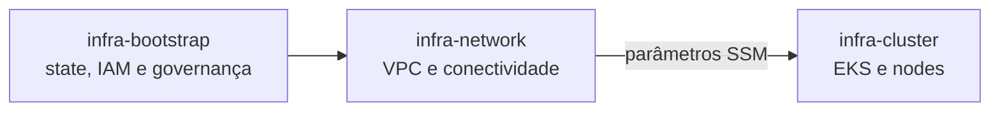

# infra-bootstrap

Produto de infraestrutura responsável pela fundação compartilhada da conta AWS.
Provisiona recursos globais e pré-requisitos consumidos pelos demais produtos da
plataforma, sem assumir ownership de VPC, cluster, workloads ou observabilidade.

## Escopo

Inclui:

- bucket S3 compartilhado para states Terraform, com versionamento, criptografia
  e bloqueio de acesso público;
- provider OIDC do GitHub Actions;
- role e policy de CI do `infra-network`, limitadas ao backend, recursos de rede
  e ao prefixo SSM publicado pelo produto;
- role de CloudWatch Logs e configuração global da conta do API Gateway.

Não inclui VPC, sub-redes, gateways, rotas, endpoints, DNS de infraestrutura,
Amazon EKS ou serviços compartilhados do Kubernetes.

## Dependências e consumidores



O `infra-network` consome o bucket informado por `terraform_state_bucket`. A
role publicada em `infra_network_github_actions_role_arn` será usada na migração
do pipeline de access keys estáticas para OIDC.

## Primeira implantação

O bootstrap não pode usar, na primeira execução, o backend que ele próprio ainda
vai criar. A implantação inicial usa state local:

```bash
cp terraform.tfvars.example terraform.tfvars
terraform init
terraform fmt -check -recursive
terraform validate
terraform plan -out=tfplan
terraform apply tfplan
```

Depois que o bucket existir, adicione um bloco `backend "s3"` para o próprio
bootstrap e execute `terraform init -migrate-state`. Faça backup do state local
antes da migração e nunca o remova até confirmar o state remoto.

## Ordem de adoção

1. Aplicar o `infra-bootstrap` com state local.
2. Migrar e validar o state do bootstrap no bucket criado.
3. Configurar nos consumidores o bucket, a chave e a região.
4. Configurar `AWS_ROLE_ARN` com o output da role OIDC.
5. Migrar os workflows para `role-to-assume` e remover access keys estáticas.
6. Aplicar o `infra-network`.

Como nenhum recurso desta plataforma foi implantado, não há `terraform import`
ou `terraform state mv` nesta transferência de ownership.

## Segurança e operação

- O bucket possui `prevent_destroy`; sua remoção exige mudança explícita.
- A role do `infra-network` confia somente no environment `production` do
  repositório configurado, usando o subject OIDC imutável com IDs de owner e
  repositório.
- Alterações em IAM, backend ou configurações globais exigem revisão de segurança
  e evidência do Terraform plan.
- `terraform.tfvars` e qualquer state local não devem ser commitados.

## Ownership

Owner: time de Cloud Platform.

Licença: MIT.
