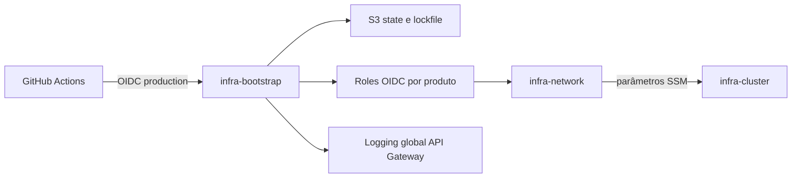

# infra-bootstrap

Produto responsável pela fundação compartilhada da conta AWS. Provisiona o
backend Terraform, federação OIDC, roles de CI e configurações globais sem
assumir ownership de rede, cluster, workloads ou observabilidade.

## Estado atual

O bootstrap está implantado com sucesso. Os recursos preexistentes foram
adotados pelo Terraform, e o state está em
`s3://orange-ks8-logs/bootstrap/dev/terraform.tfstate`, com versionamento e
locking nativo do S3. O deploy automatizado usa credenciais temporárias via
GitHub Actions OIDC.

## Escopo

Inclui:

- bucket S3 compartilhado para states Terraform;
- provider OIDC do GitHub Actions;
- role e policy de CI do `infra-bootstrap`;
- role e policy de CI do `infra-network`;
- role de CloudWatch Logs e configuração global do API Gateway.

Não inclui VPC, sub-redes, gateways, rotas, endpoints, DNS, Amazon EKS,
serviços Kubernetes, aplicações ou observabilidade.

## Arquitetura e contratos



Outputs publicados:

- `terraform_state_bucket`;
- `infra_bootstrap_github_actions_role_arn`;
- `infra_network_github_actions_role_arn`;
- `api_gateway_cloudwatch_role_arn`.

A chave do state deste produto é `bootstrap/dev/terraform.tfstate`. O contrato
SSM autorizado para a rede é `/infra-network/vpc/*`.

## Configuração

Copie o exemplo apenas para uso local:

```bash
cp terraform.tfvars.example terraform.tfvars
```

O GitHub Actions exige estas repository variables:

- `AWS_REGION`;
- `TF_STATE_BUCKET`;
- `AWS_ROLE_ARN`, apontando para a role exclusiva do bootstrap;
- `GH_OWNER_ID`;
- `INFRA_BOOTSTRAP_REPOSITORY_ID`;
- `INFRA_NETWORK_REPOSITORY_ID`.

O environment `production` faz parte do subject OIDC. Mantenha nele as
proteções e aprovações exigidas para alterações na conta AWS.

## Validação local

```bash
terraform fmt -check -recursive
terraform init -input=false
terraform validate
terraform plan
```

Resuma o plan na Pull Request sem commitar o plano binário. Não commite states,
credenciais, tokens ou `terraform.tfvars`.

## Deploy

Pull Requests executam formatação e validação sem credenciais AWS. Após merge
em `main`, o job `deploy` assume `GitHubActionsOIDCInfraBootstrapRole`, adquire
o lock remoto, gera um plano salvo e aplica exatamente esse plano no
environment `production`.

O bootstrap inicial já foi concluído. Em uma reconstrução de conta, a ordem é:

1. criar a fundação usando state local;
2. importar recursos preexistentes, se houver;
3. fazer backup do state local;
4. migrar para `bootstrap/dev/terraform.tfstate`;
5. validar o inventário remoto;
6. criar a role OIDC dedicada;
7. habilitar o deploy automatizado.

Não execute `apply`, `destroy`, `import`, `state mv` ou migração de backend sem
plan, backup e aprovação explícita.

## Segurança e operação

- o bucket possui `prevent_destroy`, criptografia, bloqueio público e
  versionamento;
- as trust policies usam subjects imutáveis com IDs de owner e repositório;
- a role do bootstrap confia somente no environment `production` deste repo;
- a role de rede confia somente no environment `production` do
  `infra-network`;
- alterações em IAM, backend ou configurações globais exigem revisão de
  segurança e evidência do plan;
- access keys permanentes não devem ser usadas no workflow.

## Rollback e troubleshooting

- Para reverter código, reverta o commit e gere um novo plan; não edite o state
  manualmente.
- Em falhas OIDC, confira `id-token: write`, `AWS_ROLE_ARN`, `AWS_REGION`, o
  environment e o subject da trust policy.
- Em falhas de backend, confira a chave do state, o arquivo `.tflock` e as
  permissões S3 da role.
- O bucket possui versionamento; restaure versões somente com backup, análise
  do impacto e aprovação.
- O aviso de depreciação do Node 20 não deve ser contornado habilitando runtimes
  inseguros; atualize as actions para versões suportadas.

## Próximos passos

1. Migrar o pipeline do `infra-network` para a role OIDC publicada.
2. Criar roles de CI independentes para os demais produtos.
3. Avaliar KMS gerenciado para o backend.
4. Adicionar CloudTrail, AWS Config, GuardDuty, budgets e alertas.

## Ownership

Owner: time de Cloud Platform.

Licença: MIT.
